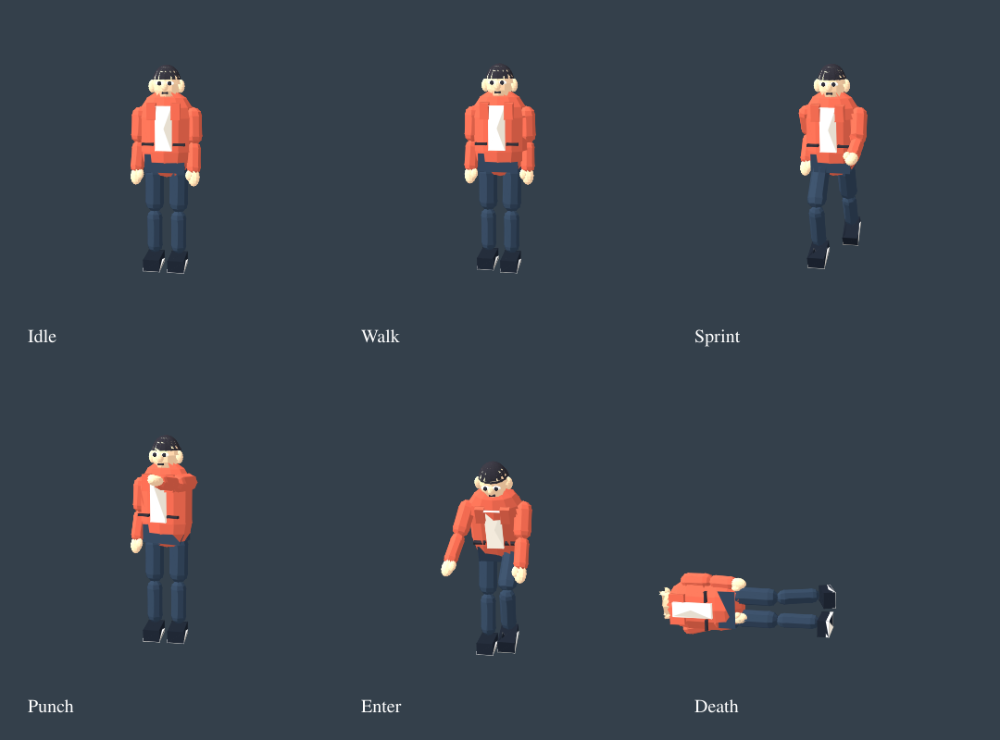

# Character motion — stage 2 foundation

Branch: codex/prebaked-motion. Builds on fbb0f15.

## Implemented

- Original stylized humanoid: jacket/shirt, trousers, shoes, face, ears, eyes and hair.
- Six skinned material batches share one 11-bone skeleton. Upper limbs blend weights
  near the elbow/knee; this is a lightweight authored rig, not a downloaded Meshy character.
- Ten precomputed animation clips: Idle, Walk, Run, Sprint, Punch, Hit, Enter, Exit, Fall, Death.
- Runtime only restores buffers/skeleton/clips and evaluates the selected animation;
  no mesh construction, rig generation, gait analysis or clip synthesis at startup.
- Speed-based locomotion playback, 0.16-second crossfade, action timer synchronization,
  explicit exit/entry distinction, death-to-idle recovery and idempotent disposal.
- All tiers use a single player rig. No per-citizen skeleton/mixer has been introduced.
- Rebuild via `npm run bake:character`. A source hash test rejects stale committed data.

## Review iterations

1. Created the skin and authored motion clips offline; existing 12 gameplay tests passed.
2. Added weight normalization, clip/source freshness, actual skinned vertex deformation,
   death/revival and attack-to-idle transition tests.
3. Rendered six actual posed models with CPU skinning and SVGRenderer. The first preview
   exposed a hair-shell opening; replaced it with a full top cap and separate rear volume.
4. Kept the model to six material batches and roughly 257 KB serialized scene/motion data.

This preview uses temporary Lambert materials and a painter-based SVG renderer. It is
not proof of WebGL skin-shader compilation, final lighting, FPS or HIGH day/night acceptance.
Its overlapping surfaces can show SVG sorting artifacts. The character remains stylized;
Cabsolutely-level realistic appearance and foot IK are not claimed.

## Remaining five planned stages

3. Bounded near-NPC rig pool (32–48 maximum candidate budget, adjusted after measurement).
4. Predictive vehicle avoidance, surprise, escape, guarding, stumble and recovery.
5. Complete vehicle integration: collision impulse response and remaining model/contact work.
6. Consolidate compressed model/clip assets, loading/preload lifecycle and startup measurements.
7. Real-browser day/night review, device profiling and tier/budget tuning.

Vehicle prebaking and this character bake bring part of stage 6 forward. They do not replace
its compression/loading/startup acceptance. Stage 2's animation foundation is implemented;
realistic art refinement and live visual acceptance are still outstanding.

## Validation results

- TypeScript and production build passed.
- Full current regression suite: 165 passed, zero failures.
- Focused suite after hair/art correction: 15 passed, zero failures.
- Final generated module: 34,037 bytes gzip (approximately 257 KB serialized data).
- Geometry-only six-pose image inspected and revised; live WebGL/real-device QA pending.
