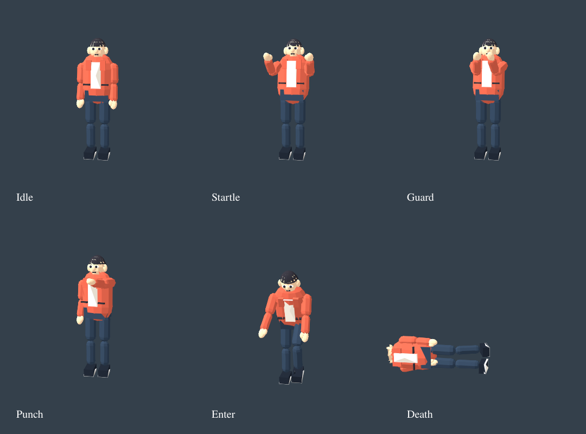

# Stage 4: predictive pedestrian reactions

Branch: codex/prebaked-motion. Continues 25156e8.

## Implemented

The driven vehicle's warning corridor is replaced with a 1.6-second bounded trajectory
prediction using body dimensions, signed speed/course, yaw rate and pedestrian velocity.
It handles reversing and turning as well as straight-line approach. Work is limited to
10 Hz, existing local crowd cells, and the closest 64 eligible pedestrians per update.
No navigation network or spatial index is rebuilt at startup.

Predicted threats produce look, startle, escape or guard. Safe escape candidates must
avoid predicted vehicle contact at their endpoint and along their moving trajectory;
all path samples including the endpoint must pass existing walkability/occupancy checks.
Escape direction feeds the existing scatter steering, with a 0.45-second refresh cooldown.
Expired reaction state blends back into ordinary movement. Actual impacts retain the
existing thrown-body lifecycle and signal-reservation release.

Occupied crossings and authored crossing choreography receive visual warnings but are
not redirected by this module. Their existing signal-safe movement remains authoritative.
The new predictor is for the controlled vehicle; normal AI traffic retains existing behavior.
This is a sampled prediction and avoidance preference, not a collision-free guarantee.

Near rigs turn their head toward an approaching threat and use offline-baked Startle and
Guard clips. Threatened actors get priority in the bounded near-rig pool. Base instanced
figures use their existing shared arm shader for a warning gesture. No per-NPC mesh or
animation assets are generated at runtime.

## Review loop

- Added forward/reverse/departing, yaw, moving pedestrian, unsafe-route and throttle tests.
- Corrected path sampling to include the exact endpoint.
- Added moving-escape trajectory checks after reviewing crossing-path risk.
- Authored two dedicated clips instead of reusing the hit reaction for every warning.
- Inspected actual posed geometry and moved guard arms inward to distinguish guarding
  from surprise. Total baked character module is 34,812 bytes gzip (previously 34,037).

## Acceptance limits

Final focused suite: 22 passed. Pose preview uses CPU skinning/SVGRenderer, not live WebGL.
Real HIGH day/night scene, actual GPU shader execution and measured startup/FPS acceptance
remain pending. Stale reaction properties expire by simulation time; no background timer,
network service, new texture or runtime asset generator was added.

## Remaining three planned stages

5. Remaining vehicle collision impulse/contact integration.
6. Consolidated compressed asset loading and measured startup acceptance.
7. Real-device visuals/performance and final tier tuning.

Art realism and the prior increments' unverified live visual acceptance remain tracked
work within the final review; they are not claimed complete by unit tests.

Final integration: TypeScript check, production build and all 172 maintained tests passed.
The last guard-pose adjustment additionally passed all 22 focused tests and pose inspection.
