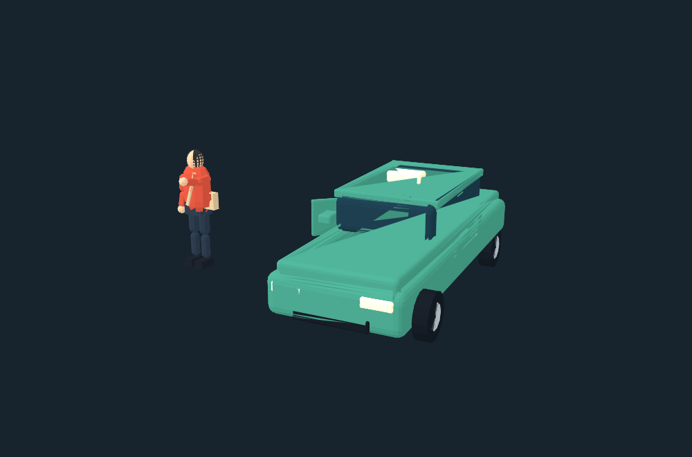
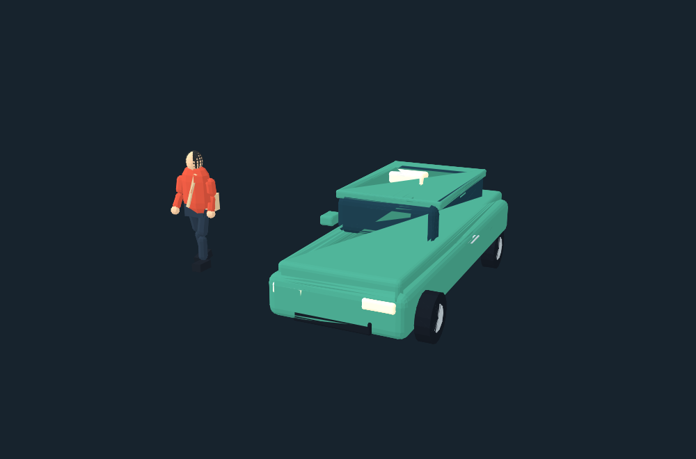

# Playable Shibuya refinement — 2026-09-18

Playable foundation commit: `1e28734`. Street-action self-improvement commit: `e26bf9b`.

Branch: `codex/tokyo-playable-polish`. Base: `6c2dae9152828e628caca7673e0132aeb2d75d8a`.

This pass improves the existing small Shibuya sandbox toward a Tokyo open-world game. It does not claim GTA-scale content or visual quality.

## Implemented

- **Controls and camera:** time-based gamepad look, side-effect-free input reads, analogue walking speed, measured movement animation, damped following, swept camera arm collision, and a longer car camera with a closer look target. Tab releases pointer lock for the HUD; Escape returns to observation.
- **Player and car:** articulated rigid-limb character with clothing and bag; detailed controlled car with windows, mirrors, handles, wheels, steering, and suspension motion. Scooters retain their existing model. The simulation slot remains authoritative. Dynamic vehicle definitions now follow a changed car type; substeps improve wall collision and the playable boundary prevents driving past the generated city.
- **Street response:** nearby instanced limb motion, local runner reactions, and small safe waiting-position offsets. Existing pedestrian/vehicle signal separation remains intact. The crowd retains its 13-geometry/3-material contract.
- **Feedback:** bounded smoke and sparks, damage-sensitive engine sound, silence on exit, toned-down player-mode headlight beams, and controlled parked-slot headlight glows. Dead players cannot enter a car.
- **HUD and objective:** compact play HUD, a north-up network minimap drawn at 5 Hz, speed/damage/entry information, and a repeatable three-stop delivery. Stops are reachable on the existing pedestrian network; dismount and stand still to deliver. The four-minute timer pauses in hidden tabs; contact penalties, completion, cancellation, timeout, and knockdown failure are handled.
- **Lifecycle:** player mode exits before relevant module rebuilds; controlled crowd reservations are released; all new scene resources dispose explicitly.

## Self-improvement loop: street actions

- **Melee:** E, primary mouse, controller X, or the touch attack button starts a short forward strike. Only nearby adult ambient pedestrians on safe pavement can be engaged; children, crossing choreography, and occupied crossings are excluded. The NPC leaves any queue reservation, turns, closes distance, counterattacks with a cooldown, and either participant can reach zero health. A defeated NPC uses the existing bounded fall/despawn lifecycle; player defeat uses the existing revive flow.
- **Carjacking:** parked vehicles and ordinary traffic stopped below 0.35 m/s can be selected. The selected traffic slot is frozen, reused as the controlled slot, and remains visible to traffic collision queries. Moving vehicles, service vehicles, and already controlled vehicles cannot be taken.
- **Visible entry/exit:** the player eases to or from the nearest unblocked door over 0.78/0.9 seconds. The detailed controlled-car door swings during the transition and the player leans/reaches instead of disappearing instantly.
- **More human crowd motion:** the existing instanced bodies retain 13 shared geometries and 3 materials, but their tagged arms/legs now receive walking cadence, subtle idle sway, facing variation, and a combat gesture in the shared vertex shader. This avoids one skeleton, animation mixer, or unique mesh per citizen.
- **Asset/startup budget:** no downloaded model, texture, animation, or audio file was added. Combat and transitions reuse fixed actor/vehicle pools and synthesized audio. The static city, traffic graph, and HIGH pedestrian network remain in the pre-generated static pack; its key is unchanged.



## Main files

Integration: `app/ShibuyaScene.tsx`, `app/globals.css`.

Player: `src/player/{controller,camera,figure,vehicle,vehicle-visual,effects,audio,crowd-interaction,objective,play-ui}.mjs`.

Crowd/traffic: `src/life/{render,gait}.mjs`, `src/traffic/{render,headlight-glows}.mjs`.

Regression coverage: `tests/player-experience.test.mjs`, registered in `scripts/test-current.mjs`.

## Validation and remaining acceptance

- TypeScript check passed; the integration build and all 158 current tests passed. The street-action loop adds focused coverage for melee, death, stopped-traffic theft, signal-permit release, door poses, and deterministic entry/exit.
- Tests cover camera wall clipping and damping, gamepad reads, movement, vehicle type/bounds, delivery success/failure/retry and actual HIGH network routes, geometry/disposal, crowd rendering contracts, and local reactions.
- Static model cache key remains `25ea9435dd5f8cd888702759468eea2f0a6505f27d3f0d598ee05ad615975260`; no static pack rebake or new production dependency is required.
- The supplied gameplay video informed camera, crowd and HUD changes. The available remote browser reports WebGL2 unavailable. **The modified game has not passed live HIGH day/night visual acceptance, GPU shader compilation, touch/gamepad hardware acceptance, or measured FPS acceptance.** Automated tests are not substitutes for these checks.
- The geometry preview was rendered from the actual new model builders with Three.js SVGRenderer and temporary Lambert materials. It is a shape inspection, not a screenshot of the game or evidence of final lighting.
- Delivery is a first repeatable activity. There is no new wanted/police system, combat, interiors, narrative campaign, save progression, or expanded Tokyo map in this pass.



## Run and review

```sh
npm ci
npm run dev:local
```

Open `http://127.0.0.1:5174/?tier=high&time=night&camera=scramble`, wait for loading, and enter player mode. Move with the existing WASD controls, use F near a car, and use Tab to access the delivery button. Visit green targets on foot and stop for about 1.2 seconds. Escape returns to observation.

Before merging/deploying: inspect fixed HIGH day/night cameras, near-crowd limb shading, car camera obstruction, smoke/lights, repeated mode entry/exit and module rebuilds. Try MEDIUM and LOW, touch landscape controls, actual gamepad input, knockdown/revive, delivery restart and visibility pause. Record screenshots and actual performance; do not infer FPS from Node timings.

No push or public deployment is included. See the branch's implementation and handoff commits for exact SHAs.
